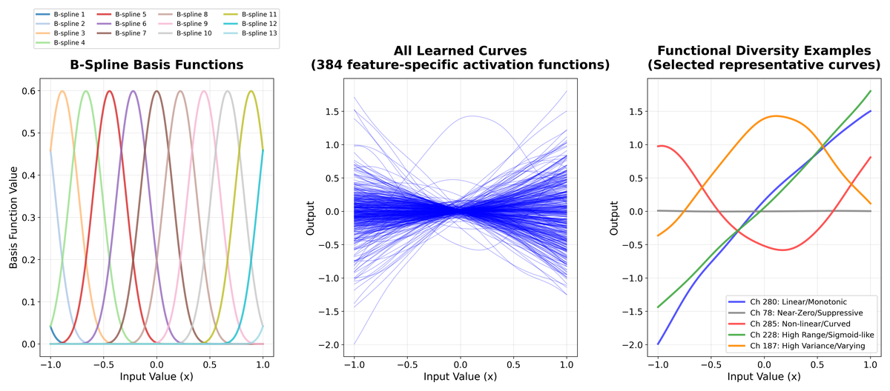
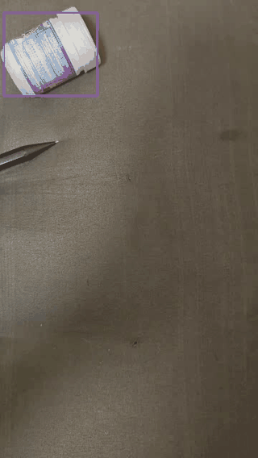
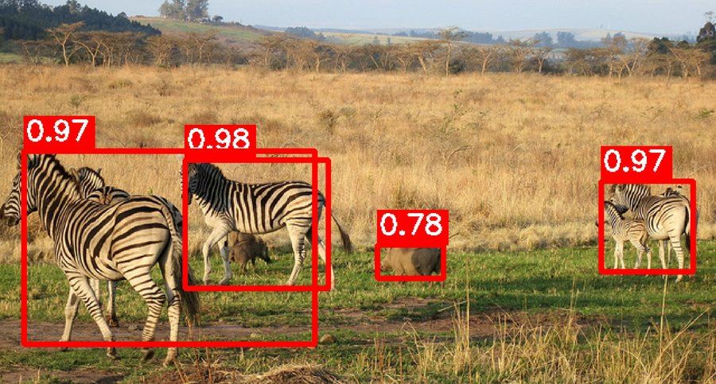
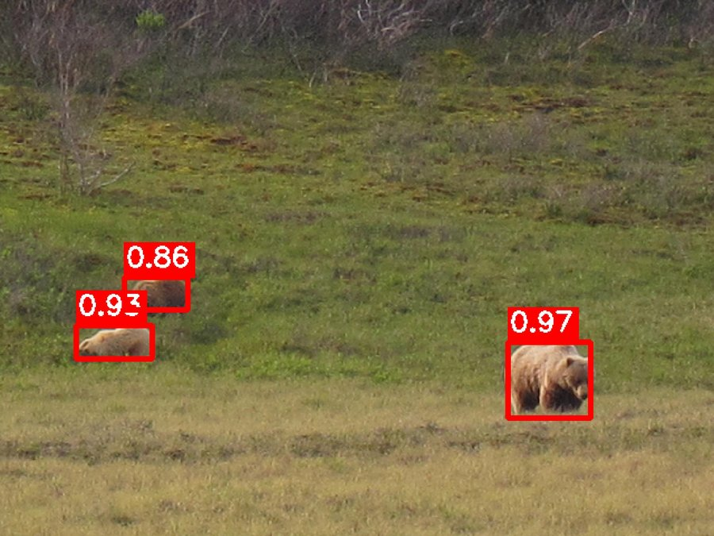
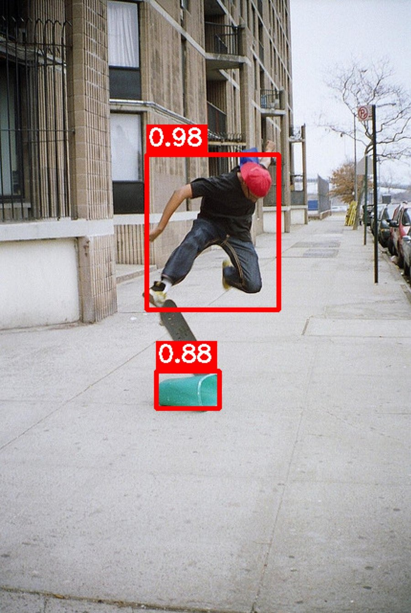
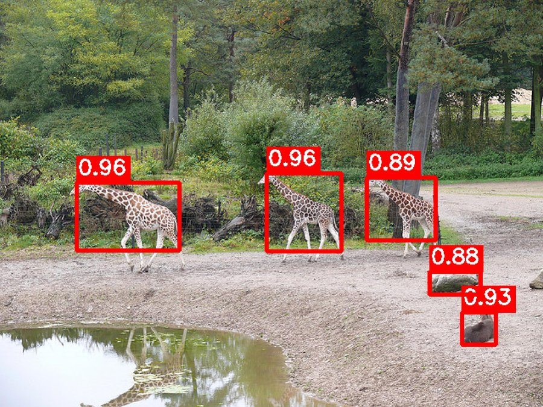
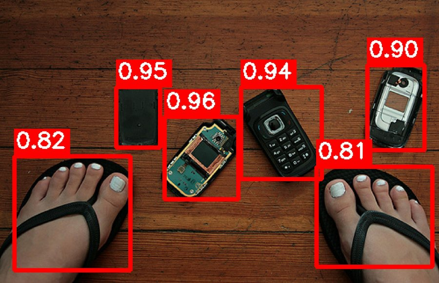
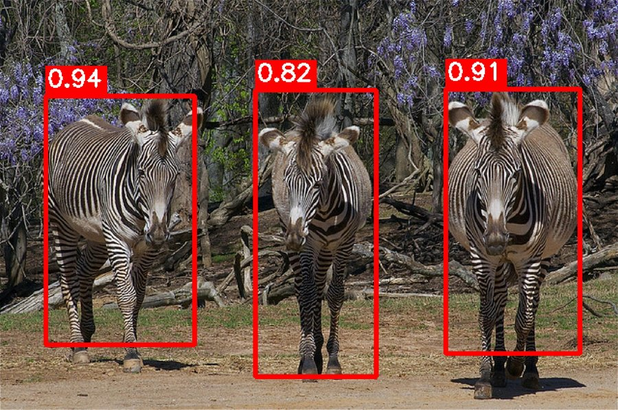
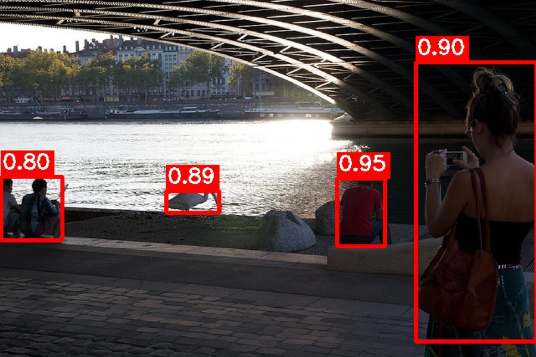

# KFOUND: KAN-Based FOUND for Unsupervised Class-Agnostic Object Detection

<p align="center">
  <a href="https://doi.org/10.1016/j.mlwa.2026.100870">
    
  </a>
  <a href="https://doi.org/10.1016/j.mlwa.2026.100870">
    
  </a>
  <a href="LICENSE">
    
  </a>
  
  
</p>

<p align="center">
  <b>Yuno Otsuka, Pittipol Kantavat, Boonserm Kijsirikul</b><br>
  <i>Department of Computer Engineering, Faculty of Engineering, Chulalongkorn University, Bangkok, 10330, Thailand</i><br>
  <i>Machine Learning with Applications, Elsevier, 2026</i>
</p>

---

## Abstract

> We present **KFOUND**, an unsupervised class-agnostic object detection pipeline that integrates Kolmogorov-Arnold Networks (KANs) into the FOUND background-based saliency framework. Unlike conventional 1×1 convolutional decoders that apply identical activation patterns across all feature channels, the proposed KAN decoder employs learnable B-spline activation functions—enabling channel-specific, non-linear feature transformations with only **5,760 parameters**. The resulting pipeline achieves superior saliency detection (IoU = 0.693 on DUTS-TE) and class-agnostic object detection performance (AP50 = 20.3 on COCO20k), while operating at **45 FPS** on standard hardware. Our approach requires **no human annotations** at any stage of training, making it broadly applicable across domains.

**Key Contributions:**
- A KAN-based decoder for unsupervised saliency object segmentation.
- A complete 4-stage unsupervised detection pipeline: background segmentation → pseudo-box generation → Faster R-CNN training.
- State-of-the-art class-agnostic AP50 on COCO20k (20.3) and Pascal VOC12 (39.7) among annotation-free methods.

---

## Network Architecture & Pipeline

<p align="center">
  
  <br>
  <em>Figure: KFOUND's activation functions.</em>
</p>

### Four-Stage Training Pipeline

```
Stage 0 (one-time) ──────────────────────────────────────────────
  DUTS-TR ──► DINO ViT-S/8 ──► NCut seeds ──► Train KAN Decoder
  Output: weights/decoder_weights_kfound_g9d4.pt  (5,760 params)

Stage 1 (per dataset) ───────────────────────────────────────────
  COCO20k ──► DINO ViT-S/8 ──► KAN Decoder ──► DenseCRF ──► Masks

Stage 2–3 ───────────────────────────────────────────────────────
  Masks ──► Connected Components ──► Pseudo Bboxes
            (optional) MaskCut complement

Stage 4 ──────────────────────────────────────────────────────────
  Pseudo Bboxes + COCO20k ──► Train Faster R-CNN (DINO / DetCo RN50)

Inference (no KFOUND needed) ─────────────────────────────────────
  Image ──► Faster R-CNN only ──► Class-Agnostic Detections
```

During **inference**, only the trained Faster R-CNN detector is needed — the KFOUND decoder is not required.

---

## Requirements & Installation

**Hardware:** NVIDIA GPU with ≥8 GB VRAM recommended (tested on RTX 4070 Ti / 12 GB VRAM, AMD Ryzen 5 7600, 32 GB RAM)  
**Software:** CUDA 11.8+, Python 3.10, Detectron2

### 1. Create Environment

```bash
conda create -n kfound python=3.10 -y
conda activate kfound
```

### 2. Install PyTorch (with CUDA)

```bash
# Adjust CUDA version as needed
pip install torch torchvision --index-url https://download.pytorch.org/whl/cu118
```

### 3. Install Detectron2

```bash
pip install 'git+https://github.com/facebookresearch/detectron2.git'
```

### 4. Install Other Dependencies

```bash
pip install -r requirements.txt
```

> **Note:** `pydensecrf` requires a C compiler. On Ubuntu: `sudo apt-get install build-essential`

---

## Dataset Preparation

### COCO 20K

The COCO20K subset consists of 19,817 randomly selected images from COCO train2014. The file list is provided in [`coco_20k_filenames.txt`](coco_20k_filenames.txt).

```bash
mkdir -p data/coco20k/images/{train,val}
mkdir -p data/coco20k/annotations

# Download COCO train2014 images
wget http://images.cocodataset.org/zips/train2014.zip
unzip train2014.zip

# Download COCO val2017 images (for evaluation)
wget http://images.cocodataset.org/zips/val2017.zip
unzip val2017.zip

# Download COCO annotations
wget http://images.cocodataset.org/annotations/annotations_trainval2014.zip
wget http://images.cocodataset.org/annotations/annotations_trainval2017.zip
unzip annotations_trainval2014.zip
unzip annotations_trainval2017.zip

# Organize: symlink or copy COCO20k images into data/coco20k/images/train/
# Use coco_20k_filenames.txt to select the 19,817 images
```

Expected structure:
```
data/coco20k/
├── images/
│   ├── train/          # COCO20k train images (from train2014)
│   └── val/            # COCO val2017 images
└── annotations/
    ├── instances_train2014.json
    ├── instances_val2017.json
    └── coco20k.json
```

### DUTS (for Decoder Training)

```bash
mkdir -p data/DUTS-TR data/DUTS-TE data/DUT-OMRON data/ECSSD

# Download from: http://saliencydetection.net/duts/
# DUTS-TR: training set (10,553 images)
# DUTS-TE: test set (5,019 images)
# DUT-OMRON: https://cvhci.anthropomatik.kit.edu/~mmartin/DUT-OMRON/
# ECSSD: https://www.cse.cuhk.edu.hk/leojia/projects/hsaliency/
```

### Pascal VOC (for Evaluation)

```bash
mkdir -p data/VOC

# Download VOC 2007 & 2012
wget http://host.robots.ox.ac.uk/pascal/VOC/voc2007/VOCtrainval_06-Nov-2007.tar
wget http://host.robots.ox.ac.uk/pascal/VOC/voc2007/VOCtest_06-Nov-2007.tar
wget http://host.robots.ox.ac.uk/pascal/VOC/voc2012/VOCtrainval_11-May-2012.tar

tar xf VOCtrainval_06-Nov-2007.tar -C data/VOC/
tar xf VOCtest_06-Nov-2007.tar -C data/VOC/
tar xf VOCtrainval_11-May-2012.tar -C data/VOC/
```

---

## Pretrained Weights

| Weight | Role in Pipeline | Origin | Acquire |
|--------|-----------------|--------|---------|
| DINO ViT-S/8 | Feature extractor (Stage 0–1) | [DINO, ICCV'21](https://arxiv.org/abs/2104.14294) | Auto-downloaded via `torch.hub` at runtime |
| DINO RN50 (Detectron2 format) | Faster R-CNN backbone init (Stage 4) | [LOST, BMVC'21](https://arxiv.org/abs/2109.14279) | `pretrained_weights/dino_RN50_pretrain_d2_format.pkl` |
| DetCo RN50 | Alternative backbone (Stage 4) | [DetCo, ICCV'21](https://arxiv.org/abs/2102.04803) | `pretrained_weights/detco_200ep_AA.pth` / `detco_200ep_AA_d2_format.pkl` |
| **KFOUND Decoder (grid=9, d=4)** | KAN saliency head (5,760 params) | This work | `pretrained_weights/decoder_weights_kfound_g9d4.pt` |
| Faster R-CNN — DINO backbone (seed 0) | Final detector (class-agnostic) | This work | `pretrained_weights/frcnn_dino_KanG9D4_seed0.pth` |
| Faster R-CNN — DetCo backbone | Final detector (class-agnostic) | This work | `pretrained_weights/frcnn_detco_g9.pth` |

> ⬇️ **Download all weights:** [OneDrive (~774 MB)](https://1drv.ms/f/c/4d88aa61c6a92896/IgAy3CFl_yEvQaw9nBSKw8exAYVV3ZxHRFJPB41VDtKPIN8?e=YztD7I) → extract as `pretrained_weights/` at repository root.

> **Attribution:** The Faster R-CNN architecture, Detectron2 configuration files, and DINO RN50 Detectron2-format weights are sourced from **LOST** (Siméoni et al., BMVC 2021). Please cite LOST alongside this work when using the detection stage.

> **Weights:** The `pretrained_weights/` folder is excluded from git (large files). Download the full weight bundle (~774 MB) from **[OneDrive](https://1drv.ms/f/c/4d88aa61c6a92896/IgAy3CFl_yEvQaw9nBSKw8exAYVV3ZxHRFJPB41VDtKPIN8?e=YztD7I)** and place the folder at the repository root.

---

## Training Pipeline

### Quick Start (Full Pipeline)

```bash
# Download DINO RN50 weights from LOST repo first
# Place as: weights/dino_RN50_pretrain_d2_format.pkl

# Run full pipeline (skip decoder training, use pretrained KFOUND decoder)
./run_pipeline.sh --skip-decoder-training --skip-stage3

# Or with MaskCut stage 3 enabled
./run_pipeline.sh --skip-decoder-training
```

### Step-by-Step

#### Stage 0: Train KFOUND Decoder (Optional — pretrained weights included)

```bash
cd KFOUND
python3 main_kfound_train.py \
    --decoder Kan \
    --g 9 --d 4 \
    --s dcrf \
    --seed 0 \
    --log-dir ./outputs \
    --dataset-dir ../data/
cd ..
```

#### Stage 1: Background Extraction (Generate Masks on COCO20k)

```bash
# Train set
python3 stage1_background_extraction.py \
    --mode train \
    --decoder KAN \
    --g 9 --d 4 --s dcrf \
    --weight ./weights/decoder_weights_kfound_g9d4.pt \
    --output_dir ./data/coco20k_kfound_crf/KanG9D4/

# Val set
python3 stage1_background_extraction.py \
    --mode val \
    --decoder KAN \
    --g 9 --d 4 --s dcrf \
    --weight ./weights/decoder_weights_kfound_g9d4.pt \
    --output_dir ./data/coco20k_kfound_crf/KanG9D4/
```

#### Stage 2-3: Create Pseudo Bounding Boxes

```bash
# Train set (--use_maskcut 0 to skip Stage 3, recommended)
python3 stage2_3_create_pseudo_bboxes.py \
    --lower-threshold 0.004 \
    --mode train \
    --use_maskcut 0 \
    --mask_folder ./data/coco20k_kfound_crf/KanG9D4/ \
    --labels_output_dir ./data/coco20k_kfound_crf/KanG9D4/

# Val set
python3 stage2_3_create_pseudo_bboxes.py \
    --lower-threshold 0.004 \
    --mode val \
    --use_maskcut 0 \
    --mask_folder ./data/coco20k_kfound_crf/KanG9D4/ \
    --labels_output_dir ./data/coco20k_kfound_crf/KanG9D4/
```

#### Pre-Stage 4: Convert Annotations (YOLO → COCO JSON)

```bash
python3 pre_stage4.py --mode train --t 0.004 --type no_mk \
    --label_basename ./data/coco20k_kfound_crf/KanG9D4/ \
    --output_path ./pred_annotations/KanG9D4/

python3 pre_stage4.py --mode val --t 0.004 --type no_mk \
    --label_basename ./data/coco20k_kfound_crf/KanG9D4/ \
    --output_path ./pred_annotations/KanG9D4/
```

#### Stage 4: Train Faster R-CNN

```bash
# DINO backbone (main)
python3 stage4_train_class_agnostic_detector.py \
    --seed 0 \
    --annotation_train ./pred_annotations/KanG9D4/train/pseudo_bboxes_0.004_no_mk.json \
    --annotation_val ./pred_annotations/KanG9D4/val/pseudo_bboxes_0.004_no_mk.json \
    --output_dir ./output_faster_rcnn/KanG9D4/

# DetCo backbone (alternative)
python3 stage4_train_detco_detector.py \
    --seed 0 \
    --annotation_train ./pred_annotations/KanG9D4/train/pseudo_bboxes_0.004_no_mk.json \
    --annotation_val ./pred_annotations/KanG9D4/val/pseudo_bboxes_0.004_no_mk.json \
    --output_dir ./output_detco/KanG9D4/
```

### Pipeline Shell Script Options

```
./run_pipeline.sh [OPTIONS]

Options:
  --seed N                    Random seed (default: 0)
  --decoder TYPE              Decoder type: Kan/Conv (default: Kan)
  --grid G                    KAN grid size (default: 9)
  --degree D                  KAN B-spline degree (default: 4)
  --smoothing TYPE            Post-processing: dcrf/bs (default: dcrf)
  --backbone TYPE             Stage 4 backbone: dino/detco (default: dino)
  --threshold T               Bbox area threshold (default: 0.004)
  --skip-decoder-training     Use pretrained decoder weights
  --skip-stage3               Skip MaskCut (recommended by ablation study)
  --skip-evaluation           Skip evaluation after training
  --decoder-weight PATH       Custom decoder weight path
```

---

## Evaluation

```bash
# Evaluate on COCO20k
python3 test_detector_coco.py \
    --model_weights ./output_faster_rcnn/KanG9D4/model_final.pth \
    --split train

python3 test_detector_coco.py \
    --model_weights ./output_faster_rcnn/KanG9D4/model_final.pth \
    --split val

# Evaluate on VOC
python3 test_detector_voc.py \
    --model_weights ./output_faster_rcnn/KanG9D4/model_final.pth \
    --year 2007

python3 test_detector_voc.py \
    --model_weights ./output_faster_rcnn/KanG9D4/model_final.pth \
    --year 2012

# Multi-seed evaluation (seeds 0, 100, 200)
python3 evaluate_frcnn_multiple_seeds.py
```

---

## Results

### Class-Agnostic Detection (AP50)

| Method | Backbone | COCO20k | VOC 2007 | VOC 2012 |
|--------|----------|:-------:|:--------:|:--------:|
| LOST | DINO RN50 | 13.0 | 33.2 | 36.2 |
| FOUND | DINO RN50 | 17.0 | 33.7 | 38.2 |
| **KFOUND (ours)** | DINO RN50 | **19.5** | **33.7** | **37.5** |
| **KFOUND (ours)** | DetCo RN50 | **20.3** | **35.9** | **39.7** |

> All results follow the LOST evaluation protocol (single-threshold class-agnostic AP50 on official test splits).

---

## Repository Structure

```
KFOUND/
├── KFOUND/                     # Core saliency model (modified from FOUND)
│   ├── KANLinear.py            # KAN implementation (B-spline activations)
│   ├── model.py                # KFoundModel: DINO ViT + KAN decoder
│   ├── main_kfound_train.py    # Decoder training on DUTS-TR
│   ├── main_kfound_evaluate.py # Saliency evaluation
│   ├── misc.py                 # Utilities (DenseCRF, bilateral solver)
│   ├── bilateral_solver.py     # Edge-aware mask refinement
│   ├── bkg_seg.py              # Background segmentation (NCut)
│   ├── configs/                # Training config
│   ├── datasets/               # Dataset loaders
│   ├── evaluation/             # Evaluation metrics
│   └── dino/                   # DINO ViT feature extractor
│
├── configs/                    # Detectron2 YAML configs (from LOST)
├── utils_function/             # CRF, detection box, metrics
├── DetCo/                      # DetCo weight conversion
├── examples/                   # Video inference demo
├── weights/                    # Pretrained decoder weights
│
├── stage1_background_extraction.py     # Stage 1: Mask generation
├── stage2_3_create_pseudo_bboxes.py    # Stage 2-3: Bbox extraction
├── pre_stage4.py                       # YOLO → COCO annotation conversion
├── stage4_train_class_agnostic_detector.py  # Stage 4: Train Faster R-CNN (DINO)
├── stage4_train_detco_detector.py      # Stage 4: Train Faster R-CNN (DetCo)
├── maskcut.py                          # MaskCut (from CutLER)
├── dino_.py                            # DINO ViT feature extraction
│
├── test_detector_coco.py               # COCO evaluation
├── test_detector_voc.py                # VOC evaluation
├── evaluate_detco_detector.py          # DetCo multi-dataset evaluation
├── evaluate_frcnn_multiple_seeds.py    # Multi-seed evaluation
│
├── run_pipeline.sh             # Master pipeline script
├── coco_20k_filenames.txt      # COCO20k image list
├── requirements.txt
└── LICENSE
```

---

## Video Demo

<p align="center">
  
  <br>
  <em>KFOUND class-agnostic detections on real-world video footage. The model detects any foreground object without class labels.</em>
</p>

The demo notebook [`examples/video_inference_demo.ipynb`](examples/video_inference_demo.ipynb) shows how to run the detector on arbitrary video using the [Supervision](https://github.com/roboflow/supervision) library.

---

## Qualitative Detection Results

The following samples show class-agnostic detections produced by KFOUND on COCO20k validation images. The detector was trained without any manual annotations.

<p align="center">
  
  
  
</p>
<p align="center">
  
  
  
</p>
<p align="center">
  
</p>
<p align="center">
  <em>Sample class-agnostic detections on COCO20k. Bounding boxes are predicted without any class labels — the model detects <em>any</em> foreground object.</em>
</p>

---

## Citation

If this work contributes to your research, please cite the following paper. For work that also uses the detection pipeline or DINO RN50 backbone, please additionally cite LOST.

```bibtex
@article{otsuka2026kfound,
  title     = {An unsupervised pipeline for class-agnostic object detection using
               self-supervised vision transformers and {Kolmogorov-Arnold Networks}},
  author    = {Otsuka, Yuno and Kantavat, Pittipol and Kijsirikul, Boonserm},
  journal   = {Machine Learning with Applications},
  volume    = {24},
  pages     = {100870},
  year      = {2026},
  publisher = {Elsevier},
  doi       = {10.1016/j.mlwa.2026.100870},
  url       = {https://doi.org/10.1016/j.mlwa.2026.100870}
}
```

```bibtex
@inproceedings{simeoni2023found,
  title     = {Unsupervised Object Localization: Observing the Background to Discover Objects},
  author    = {Sim\'eoni, Oriane and Sekkat, Chlo\'e and Puy, Gilles and Vobecky, Antonin
               and Zablocki, \'{E}loi and P\'erez, Patrick},
  booktitle = {Proceedings of the {IEEE/CVF} Conference on Computer Vision and Pattern Recognition ({CVPR})},
  year      = {2023}
}
```

```bibtex
@inproceedings{simeoni2021lost,
  title     = {Localizing Objects with Self-Supervised Transformers and no Labels},
  author    = {Sim\'eoni, Oriane and Puy, Gilles and Vo, Huy V. and Roburin, Simon
               and Gidaris, Spyros and Bursuc, Andrei and P\'erez, Patrick and Marlet, Renaud
               and Ponce, Jean},
  booktitle = {Proceedings of the British Machine Vision Conference ({BMVC})},
  year      = {2021}
}
```

---

## Acknowledgements

This project builds on, and is grateful to, the following open-source works:

| Project | Paper | Contribution to KFOUND |
|---------|-------|------------------------|
| **[FOUND](https://github.com/valeoai/FOUND)** | Siméoni et al., CVPR 2023 | Base unsupervised background saliency model |
| **[LOST](https://github.com/valeoai/LOST)** | Siméoni et al., BMVC 2021 | Faster R-CNN framework, Detectron2 YAML configs, DINO RN50 Detectron2 weights |
| **[DINO](https://github.com/facebookresearch/dino)** | Caron et al., ICCV 2021 | Self-supervised ViT-S/8 feature extractor |
| **[CutLER / MaskCut](https://github.com/facebookresearch/CutLER)** | Wang et al., CVPR 2023 | MaskCut spectral clustering (Stage 3, optional) |
| **[DetCo](https://github.com/xieenze/DetCo)** | Xie et al., ICCV 2021 | Contrastive pretraining for detection backbone |
| **[Efficient KAN](https://github.com/Blealtan/efficient-kan)** | Blealtan (2024) | Efficient B-spline KAN implementation |

---

## License

This project is distributed under the **Creative Commons Attribution 4.0 International (CC BY 4.0)** license. See [LICENSE](LICENSE) for full terms.

You are free to share and adapt this work for any purpose, provided appropriate credit is given, a link to the license is included, and any changes are indicated. See [https://creativecommons.org/licenses/by/4.0/](https://creativecommons.org/licenses/by/4.0/) for details.

Third-party components (DINO, LOST, DetCo, CutLER) retain their respective original licenses.
